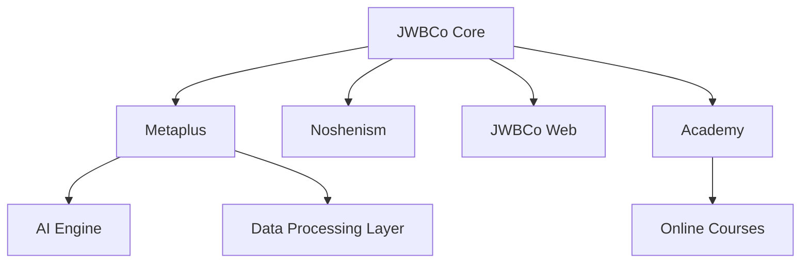
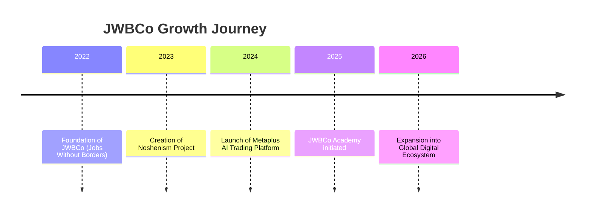

<!-- 🌑 JWBCo - Borderless Business Corporation -->
<!-- README Premium English Edition | Designed with ❤️ by Alireza Heirani -->

<h1 style="color:#F0B90B;font-size:42px;">JWBCo – Jobs Without Borders</h1>

We build the future where borders no longer exist.

---

## 🌐 Ecosystem Overview

| Project | Description | Link |
|----------|--------------|------|
| 🧠 **Metaplus** | AI-powered trading platform for global markets | [metaplus.app](#) |
| 🧭 **Noshenism** | Notion-based productivity and creativity system | [noshenism.com](#) |
| 🌍 **JWBCo Web** | Official digital hub and company website | [jwbco.com](#) |
| 🎓 **JWBCo Academy** | Learning platform for digital skills and innovation | [academy.jwbco.com](#) |

---

## 🧩 Architecture Map

---

## ⚙️ Tech Stack

  

---

## ⏳ Brand Timeline

---

## 💬 Message from the Founder – Alireza Heirani

> "JWBCo was born from a simple belief: human creativity should never be limited by geography.  
> Every product we build — from Metaplus to Noshenism — empowers people to create, trade, and grow freely across borders."  
>  
> — *Alireza Heirani, Founder & CEO*

---

## 🎨 Brand Identity

| Element | Value |
|----------|-------|
| **Primary Color** | `#F0B90B` |
| **Background** | `#0D0D0D` |
| **Accent** | `#1E1E1E` |
| **Font** | IranSans / Inter |
| **Mood** | Bold, Futuristic, Intelligent |

---

## 🪩 Social & Status Badges

---

✨ *The future belongs to those who build without borders.*  
© 2025 JWBCo – Jobs Without Borders

