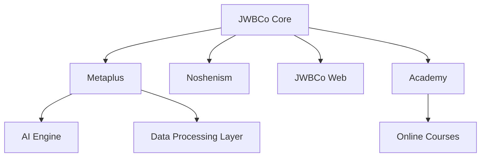
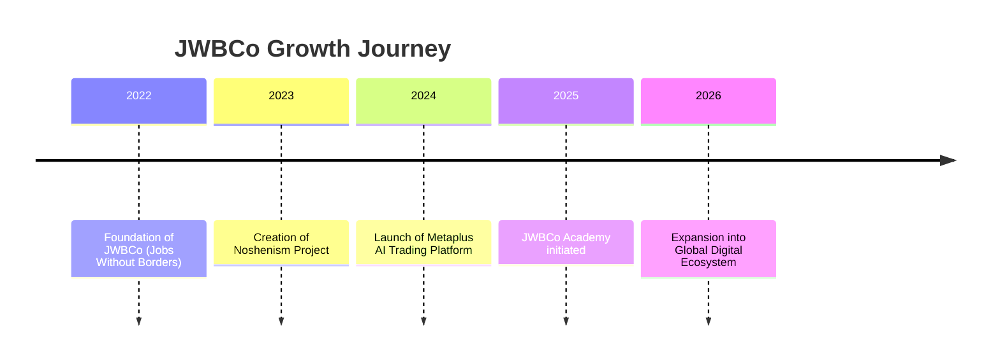

<!-- 🌑 JWBCo - Borderless Business Corporation -->
<!-- README Premium English Edition | Designed with ❤️ by Alireza Heirani -->

<h1 style="color:#F0B90B;font-size:42px;">𝐽𝑊𝐵𝐶𝑜 – 𝐽𝑜𝑏𝑠 𝑊𝑖𝑡ℎ𝑜𝑢𝑡 𝐵𝑜𝑟𝑑𝑒𝑟𝑠</h1>

𝑊𝑒 𝑏𝑢𝑖𝑙𝑑 𝑡ℎ𝑒 𝑓𝑢𝑡𝑢𝑟𝑒 𝑤ℎ𝑒𝑟𝑒 𝑏𝑜𝑟𝑑𝑒𝑟𝑠 𝑛𝑜 𝑙𝑜𝑛𝑔𝑒𝑟 𝑒𝑥𝑖𝑠𝑡.

---

## 🌐 𝐸𝑐𝑜𝑠𝑦𝑠𝑡𝑒𝑚 𝑂𝑣𝑒𝑟𝑣𝑖𝑒𝑤

| Project              | Description                                         | Link                  |
| -------------------- | --------------------------------------------------- | --------------------- |
| 🧠 **Metaplus**      | AI-powered trading platform for global markets      | [metaplus.app](#)     |
| 🧭 **Noshenism**     | Notion-based productivity and creativity system     | [noshenism.ir](#)     |
| 🌍 **JWBCo Web**     | Official digital hub and company website            | [jwbco.ir](#)         |
| 🎓 **JWBCo Academy** | Learning platform for digital skills and innovation | [academy.jwbco.ir](#) |

---

## 🧩 𝐴𝑟𝑐ℎ𝑖𝑡𝑒𝑐𝑡𝑢𝑟𝑒 𝑀𝑎𝑝

---

## ⚙️ 𝑇𝑒𝑐ℎ 𝑆𝑡𝑎𝑐𝑘

  

---

## ⏳ 𝐵𝑟𝑎𝑛𝑑 𝑇𝑖𝑚𝑒𝑙𝑖𝑛𝑒

---

## 💬 𝑀𝑒𝑠𝑠𝑎𝑔𝑒 𝑓𝑟𝑜𝑚 𝑡ℎ𝑒 𝐹𝑜𝑢𝑛𝑑𝑒𝑟 – 𝐴𝑙𝑖𝑟𝑒𝑧𝑎 𝐻𝑒𝑦𝑟𝑎𝑛𝑖

> "JWBCo was born from a simple belief: human creativity should never be limited by geography.  
> Every product we build — from Metaplus to Noshenism — empowers people to create, trade, and grow freely across borders."
>
> — _Alireza Heyrani, Founder & CEO_

---

## 🎨 𝐵𝑟𝑎𝑛𝑑 𝐼𝑑𝑒𝑛𝑡𝑖𝑡𝑦

| Element           | Value                         |
| ----------------- | ----------------------------- |
| **Primary Color** | `#F0B90B`                     |
| **Background**    | `#0D0D0D`                     |
| **Accent**        | `#1E1E1E`                     |
| **Font**          | IranSans / Inter              |
| **Mood**          | Bold, Futuristic, Intelligent |

---

## 🪩 𝑆𝑜𝑐𝑖𝑎𝑙 & 𝑆𝑡𝑎𝑡𝑢𝑠 𝐵𝑎𝑑𝑔𝑒𝑠

---

✨ _The future belongs to those who build without borders._  
© 2025 JWBCo – Jobs Without Borders

