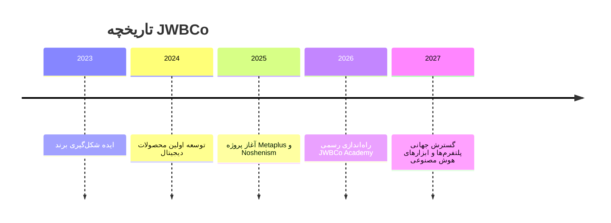
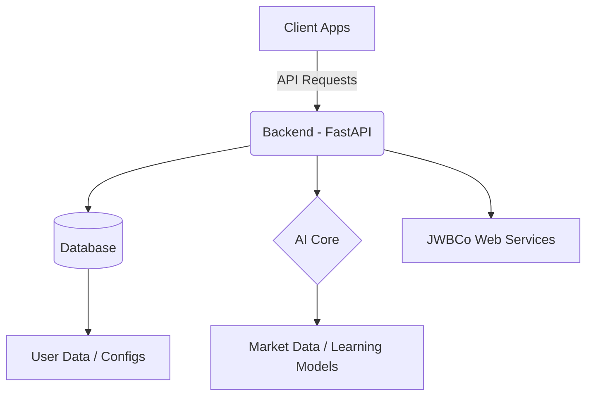
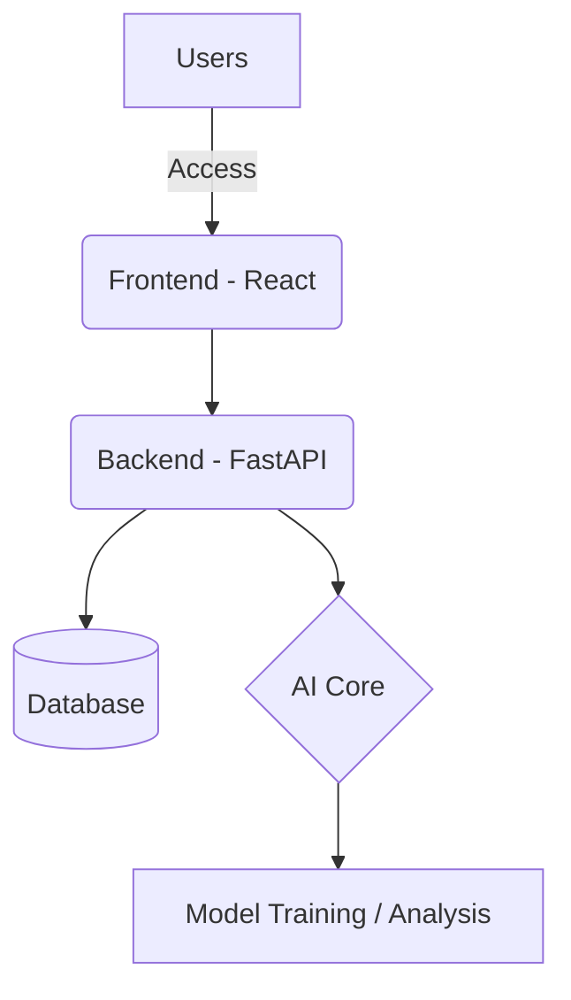

<!-- ===================== -->
<!-- 🌐 JWBCo README File -->
<!-- ===================== -->

  <!-- Logo Here -->
  

<h1 align="center" style="font-family: 'IRANSans', sans-serif;">✨ JWBCo | مشاغل بدون مرز ✨</h1>

  <b>Building Borderless Opportunities for the Digital Age</b> 
  <i>خلق فرصت‌های بدون مرز در عصر دیجیتال</i>

  
  
  
  

---

## 🏢 درباره JWBCo

**JWBCo (Jobs Without Borders)** یک اکوسیستم چندمنظوره است که در حوزه‌های **تکنولوژی، محصولات دیجیتال، آموزش و تجارت الکترونیک** فعالیت می‌کند.  
هدف ما خلق جهانی است که در آن **محدودیت جغرافیایی وجود ندارد** و هر فرد بتواند با تکیه بر مهارت، خلاقیت و ابزارهای دیجیتال رشد کند.

> 🌍 «ما مرزها را از دنیای کار حذف می‌کنیم.»

---

## 🌱 فلسفه برند

**مشاغل بدون مرز** نمادی از آزادی، خلاقیت و رشد پایدار است.  
ما به دنیایی اعتقاد داریم که در آن فرصت‌ها بر اساس استعداد سنجیده می‌شوند، نه موقعیت جغرافیایی.

---

## 🧭 مأموریت جهانی JWBCo

- توسعه زیرساخت‌های دیجیتال برای توانمندسازی افراد و کسب‌وکارها  
- ایجاد محصولات مقاوم در برابر تغییرات فناوری و هوش مصنوعی  
- گسترش فرهنگ «کار آزاد، جهانی و خلاقانه»  
- آموزش مهارت‌های آینده برای حضور در اقتصاد دیجیتال جهانی  

---

## 🧩 اکوسیستم پروژه‌ها

| پروژه | توضیح کوتاه | وضعیت | لینک |
|-------|--------------|--------|-------|
| **Metaplus** | پلتفرم معاملاتی هوشمند با هسته‌ی هوش مصنوعی | 🚀 در حال توسعه | [مشاهده پروژه](https://github.com/JWBCo/Metaplus) |
| **Noshenism** | سیستم مدیریت ذهن و خلاقیت در Notion | 🧠 طراحی مفهومی | [مشاهده پروژه](https://github.com/JWBCo/Noshenism) |
| **JWBCo Web** | وب‌سایت رسمی شرکت | 🌐 آنلاین | [https://jwbco.com](https://jwbco.com) |
| **JWBCo Academy** | آکادمی مهارت‌های دیجیتال و خلاقیت | 🎓 در حال آماده‌سازی | - |

---

## 🕰️ Timeline رشد برند

---

## ⚙️ Tech Stack & Infrastructure

| لایه | تکنولوژی‌ها |
|------|---------------|
| **Frontend** | React, Vite, TailwindCSS |
| **Backend** | FastAPI, Python |
| **Database** | PostgreSQL, MongoDB |
| **AI Core** | TensorFlow, PyTorch, Custom ML Models |
| **Automation** | Notion API, OpenAI API, Zapier |
| **Deployment** | Docker, Vercel, GitHub Actions |

---

## 🧭 Architecture Overview

---

## 🤝 همکاری در پروژه‌ها

ما به دنبال افراد خلاق، توسعه‌دهندگان، طراحان و ایده‌پردازانی هستیم که بخواهند در مسیر ساخت آینده‌ی دیجیتال همراه ما باشند.

برای همکاری:  
📧 contact@jwbco.com  
📱 [Telegram @JWBCo](https://t.me/JWBCo)

---

## 💫 مشارکت‌کنندگان (Contributors)

  

---

## 🪪 لایسنس

تمامی حقوق این ریپازیتوری متعلق به **JWBCo | مشاغل بدون مرز** است.  
استفاده از محتوا تنها با مجوز رسمی مجاز می‌باشد.  
© 2025 JWBCo. All rights reserved.

---

## 🌍 English Version

### About JWBCo

**JWBCo (Jobs Without Borders)** is a multi-purpose digital ecosystem focused on **technology, digital products, education, and e-commerce**.  
We believe in a world where **geography never limits creativity**.

> 🌎 "We remove borders from the world of work."

### Our Mission

- Empower individuals and businesses through digital infrastructure  
- Build resilient products that adapt to the evolution of AI  
- Promote the culture of creative, borderless work  
- Educate people for the future of digital economies  

### Projects Ecosystem

| Project | Description | Status | Link |
|----------|--------------|--------|------|
| **Metaplus** | AI-driven trading platform | 🚀 In development | [View project](https://github.com/JWBCo/Metaplus) |
| **Noshenism** | Creative management system in Notion | 🧠 Concept stage | [View project](https://github.com/JWBCo/Noshenism) |
| **JWBCo Web** | Official website | 🌐 Online | [https://jwbco.com](https://jwbco.com) |
| **JWBCo Academy** | Learning & digital skills platform | 🎓 Coming soon | - |

### Tech Stack

React • FastAPI • PostgreSQL • AI Core • Docker • Notion API

### Architecture Diagram

### Contact

📧 contact@jwbco.com  
🌐 [https://jwbco.com](https://jwbco.com)  
📱 [Telegram @JWBCo](https://t.me/JWBCo)

---

> **"The future belongs to those who build without borders."**  
> — JWBCo Team
