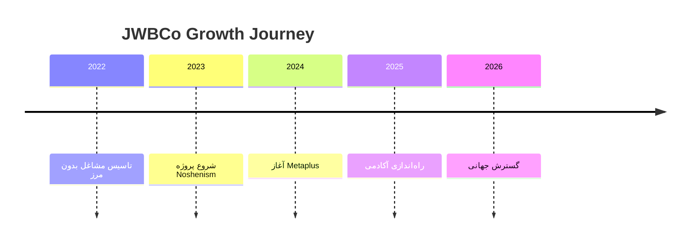

حتماً علیرضا عزیز!
در ادامه یک **README.md دوزبانه کامل، یکپارچه، حرفه‌ای و فوق‌العاده کامل** برای **مشاغل بدون مرز – JWBCo** آماده کردم که شامل:

* تمام توضیحات قبلی
* معماری سه‌لایه
* نقشه‌راه ۶ ماهه
* مدل درآمدی
* اکوسیستم کامل
* نسخه فارسی + نسخه انگلیسی
* ساختار README استاندارد برای GitHub
* با طراحی مرتب، زیبا و حرفه‌ای

---

# 📄 README.md (FA + EN)

> **کافی است این متن را مستقیماً در README.md قرار دهی.**

---

# 🌑 JWBCo – Jobs Without Borders

## README (FA + EN)

---

# 🇮🇷 نسخه فارسی

<h1 style="color:#F0B90B;">مشاغل بدون مرز – JWBCo</h1>

ما آینده‌ای را می‌سازیم که در آن هیچ مرزی وجود ندارد.

---

# 📌 معرفی کوتاه

**مشاغل بدون مرز (JWBCo)** یک اکوسیستم دیجیتال چندمنظوره است که شامل:

* پلتفرم معاملاتی و هوش مصنوعی **Metaplus**
* سیستم خلاقیت و بهره‌وری **Noshenism**
* دانشگاه مالی **JWBCo Academy**
* وب‌سایت رسمی و مرکز ابزارها **JWBCo Web**

این برند در حال تبدیل شدن به:

### **دانشگاه مالی + جامعه حرفه‌ای معامله‌گران + مرکز ابزارهای معاملاتی + اکوسیستم AI**

---

# 🌍 چشم‌انداز (Vision)

علیرضا،
این همان مسیری است که تو را از یک وب‌سایت ساده، به **یک امپراتوری آموزشی–معاملاتی** می‌رساند.

مشاغل بدون مرز قرار است تبدیل شود به:

### ✔ دانشگاه بزرگ مالی

### ✔ جامعه بزرگ معامله‌گران

### ✔ مرکز ابزارهای AI

### ✔ فروشگاه بزرگ محصولات دیجیتال

### ✔ پلتفرم سیگنال و ابزارهای حرفه‌ای

ترکیبی از:

**TradingView + BabyPips + Gumroad + AI Tools**

---

# 🧩 اکوسیستم JWBCo

| پروژه             | توضیح                                      | لینک             |
| ----------------- | ------------------------------------------ | ---------------- |
| **Metaplus**      | پلتفرم معاملاتی با هسته هوش مصنوعی         | metaplus.app     |
| **Noshenism**     | سیستم خلاقیت و برنامه‌ریزی مبتنی بر Notion | noshenism.ir     |
| **JWBCo Web**     | وب‌سایت رسمی و ابزارهای دیجیتال            | jwbco.ir         |
| **JWBCo Academy** | دانشگاه مالی                               | academy.jwbco.ir |

---

# 🧭 معماری سه‌لایه پلتفرم

## **لایه ۱: جامعه (Community Layer)**

* تالار گفتگو
* تحلیل‌های روزانه
* آموزش رایگان
* اخبار
* گروه‌های تخصصی
* مسابقات و چالش‌ها

**هدف:** ساخت جامعه و جذب ترافیک (مرحله رایگان)

---

## **لایه ۲: آکادمی مالی (MBA Trading)**

* دوره‌ها
* کلاس‌های زنده
* سیستم گواهی‌نامه
* داشبورد دانشجو
* آزمون‌ها

**درآمد:**
اشتراک ماهانه + فروش دوره + VIP

---

## **لایه ۳: ابزارها + AI**

* ژورنال آنلاین
* اسکنر هوشمند
* داشبورد مدیریت سرمایه
* تشخیص هوشمند عرضه/تقاضا
* تحلیل کندل‌به‌کندل با AI
* ابزار نقشه نقدینگی

**درآمد:**
اشتراک ماهانه + فروش ابزارها + API

---

# ⏳ تایم‌لاین برند

---

# 🧱 معماری سایت JWBCo

1. خانه (Landing)
2. درباره ما
3. آکادمی
4. دوره‌ها
5. ابزارها
6. محصولات دیجیتال
7. بلاگ
8. جامعه
9. سیگنال‌ها
10. داشبورد کاربر
11. پشتیبانی

---

# 🚀 نقشه‌راه ۶ ماهه (Roadmap)

## **ماه ۱: ساخت زیرساخت**

* طراحی منو
* ساخت صفحات اصلی
* ۵ محتوای رایگان
* بلاگ
* بخش جامعه نسخه اولیه
* اولین محصول دیجیتال Notion

---

## **ماه ۲: راه‌اندازی آکادمی**

* ۳ دوره اولیه
* سیستم عضویت
* گواهی‌نامه
* داشبورد
* لندینگ آکادمی

---

## **ماه ۳: ابزارهای دیجیتال**

* ژورنال معاملاتی
* چک‌لیست هوشمند
* داشبورد سرمایه
* اشتراک ۳۰ روزه

---

## **ماه ۴: توسعه AI**

* تحلیلگر AI
* ابزار واگرایی
* نقشه نقدینگی

---

## **ماه ۵: سیگنال و VIP**

* اتاق سیگنال
* VIP
* سیستم امتیاز تریدر

---

## **ماه ۶: رشد و مقیاس**

* ۲۰ محتوای رایگان
* کمپین تبلیغاتی
* همکاری با تریدرهای بزرگ
* API نسخه اولیه

---

# 💬 پیام بنیان‌گذار

> **"انسان خلاق نمی‌تواند محدود باشد.
> مشاغل بدون مرز برای ساختن آینده بدون مرز متولد شد."**
> — علیرضا حیرانی، Founder & CEO

---

# 🎨 هویت برند

| المان     | مقدار                      |
| --------- | -------------------------- |
| رنگ اصلی  | `#F0B90B`                  |
| پس‌زمینه  | `#0D0D0D`                  |
| فونت      | IranSans / Inter           |
| حالت برند | آینده‌نگر، هوشمند، قدرتمند |

---

# 🧠 Tech Stack

* React
* FastAPI
* Tailwind
* Docker
* AI Engine

---

# 🪩 Status Badges

---

# 🇬🇧 English Version

<h1 style="color:#F0B90B;">JWBCo – Jobs Without Borders</h1>

---

## 📌 About

JWBCo is a multi-layer digital ecosystem built to empower creativity, trading, learning, and innovation without limitations.

It includes:

* **Metaplus** – AI Trading Platform
* **Noshenism** – Notion Creativity System
* **JWBCo Academy** – Financial University
* **JWBCo Web** – Official Digital Hub

---

## 🌍 Vision

To build the **largest financial education platform + trader community + AI tools ecosystem** in the region.

A combination of:

**TradingView + BabyPips + Gumroad + AI Trading Tools**

---

## 🧩 Ecosystem Overview

| Project   | Description                  | Link             |
| --------- | ---------------------------- | ---------------- |
| Metaplus  | AI-powered trading platform  | metaplus.app     |
| Noshenism | Productivity system          | noshenism.ir     |
| JWBCo Web | Official hub                 | jwbco.ir         |
| Academy   | Financial education platform | academy.jwbco.ir |

---

## 🧭 Three-Layer Architecture

### **Layer 1: Community**

* Forums
* Free education
* Daily analysis
* Market news

---

### **Layer 2: Academy**

* Video courses
* Live classes
* Certificates
* Exams
* Student dashboard

---

### **Layer 3: Tools & AI**

* Trading journal
* Smart scanner
* Risk dashboards
* AI candle-by-candle analysis
* Liquidity map

---

## 🧱 Website Structure

* Home
* About
* Academy
* Courses
* Tools
* Store
* Blog
* Community
* Signals
* Dashboard
* Support

---

## ⏳ Roadmap (6 Months)

Month 1 → Base Website
Month 2 → Academy
Month 3 → Tools
Month 4 → AI
Month 5 → Signals
Month 6 → Scaling

---

## 💬 Founder’s Message

> “JWBCo was born from one belief:
> **Creativity should never be limited by geography.**”
> — *Alireza Heyrani*

---

## 🎨 Brand Identity

Primary Color: **#F0B90B**
Background: **#0D0D0D**
Mood: Futuristic, Intelligent

---

✨ The future belongs to those who build without borders.
© 2025 JWBCo

---

# ✅ اگر خواستی:

می‌توانم همین README را تبدیل کنم به:

* نسخه **GitHub Pages**
* نسخه **HTML آماده**
* نسخه **PDF**
* نسخه کوتاه مخصوص لندینگ
* نسخه اختصاصی **Metaplus**

بگو کدام را می‌خواهی؟
