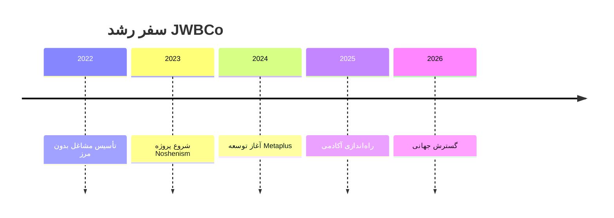

# JWBCo – Jobs Without Borders
## مشاغل بدون مرز

<div align="center">


[](https://jwbco.ir)
[](https://jwbco.ir)
[](LICENSE)
[](https://github.com/JWBCo/jwbco-web)

</div>

---

# 🇮🇷 نسخه فارسی

<div align="center" style="background-color:#0D0D0D;padding:40px;border-radius:20px;font-family:IRANSans,Inter,sans-serif;color:white;">


<h1 style="color:#F0B90B; margin:20px 0;">مشاغل بدون مرز – JWBCo</h1>
<p style="color:#ccc; font-size:1.2em;">ما آینده‌ای را می‌سازیم که در آن هیچ مرزی وجود ندارد.</p>

</div>

---

## 📊 آمار و ارقام

<div align="center">


</div>

---

## 🎯 معرفی پروژه

**مشاغل بدون مرز (JWBCo)** یک اکوسیستم دیجیتال چندمنظوره است که شامل:

- 🚀 **Metaplus** - پلتفرم معاملاتی با هسته هوش مصنوعی
- 📝 **Noshenism** - سیستم خلاقیت و برنامه‌ریزی مبتنی بر Notion  
- 🎓 **JWBCo Academy** - دانشگاه مالی و آموزشی
- 🌐 **JWBCo Web** - وب‌سایت رسمی و مرکز ابزارها

---

## 🎨 هویت برند

| المان | مقدار |
|-------|--------|
| 🎨 رنگ اصلی | `#F0B90B` |
| ⚫ پس‌زمینه | `#0D0D0D` |
| 🔤 فونت | IranSans / Inter |
| 🎭 حالت برند | آینده‌نگر، هوشمند، قدرتمند |

---

## 🏗️ معماری سه‌لایه پلتفرم

### **لایه ۱: جامعه (Community Layer)**
- 🗣️ تالار گفتگو و انجمن
- 📊 تحلیل‌های روزانه بازار
- 🆓 آموزش‌های رایگان
- 📰 اخبار و به‌روزرسانی‌ها
- 👥 گروه‌های تخصصی تریدینگ
- 🏆 مسابقات و چالش‌های معاملاتی

**🎯 هدف:** ساخت جامعه و جذب ترافیک (مرحله رایگان)

---

### **لایه ۲: آکادمی مالی (MBA Trading)**
- 🎥 دوره‌های ویدیویی تخصصی
- 🔴 کلاس‌های زنده و تعاملی
- 📜 سیستم گواهی‌نامه معتبر
- 📊 داشبورد پیشرفت دانشجو
- 🧪 آزمون‌های ارزیابی مهارت

**💰 مدل درآمد:** اشتراک ماهانه + فروش دوره + عضویت VIP

---

### **لایه ۳: ابزارها + هوش مصنوعی**
- 📖 ژورنال معاملاتی آنلاین
- 🔍 اسکنر هوشمند بازار
- 💼 داشبورد مدیریت سرمایه
- 🤖 تشخیص هوشمند سطوح عرضه/تقاضا
- 🕯️ تحلیل کندل‌به‌کندل با AI
- 🗺️ ابزار نقشه نقدینگی بازار

**💰 مدل درآمد:** اشتراک ماهانه + فروش ابزار + API

---

## 🧩 اکوسیستم JWBCo

| پروژه | 🎯 توضیحات | 🔗 لینک |
|-------|------------|---------|
| **Metaplus** | پلتفرم معاملاتی با هسته هوش مصنوعی | [metaplus.app](https://metaplus.app) |
| **Noshenism** | سیستم خلاقیت و برنامه‌ریزی مبتنی بر Notion | [noshenism.ir](https://noshenism.ir) |
| **JWBCo Web** | وب‌سایت رسمی و ابزارهای دیجیتال | [jwbco.ir](https://jwbco.ir) |
| **JWBCo Academy** | دانشگاه مالی و مرکز آموزش | [academy.jwbco.ir](https://academy.jwbco.ir) |

---

## ⏳ تاریخچه رشد برند



---

## 🗺️ نقشه‌راه ۶ ماهه

### **ماه ۱: 🏗️ ساخت زیرساخت**
- [x] طراحی منو و ساختار سایت
- [x] ساخت صفحات اصلی
- [x] تولید ۵ محتوای رایگان آموزشی
- [x] راه‌اندازی بلاگ
- [x] بخش جامعه (نسخه اولیه)
- [x] اولین محصول دیجیتال Notion

### **ماه ۲: 🎓 راه‌اندازی آکادمی**
- [ ] ۳ دوره آموزشی اولیه
- [ ] سیستم عضویت و پرداخت
- [ ] سیستم گواهی‌نامه
- [ ] داشبورد دانشجو
- [ ] لندینگ اختصاصی آکادمی

### **ماه ۳: 🛠️ ابزارهای دیجیتال**
- [ ] ژورنال معاملاتی پیشرفته
- [ ] چک‌لیست هوشمند معاملاتی
- [ ] داشبورد مدیریت سرمایه
- [ ] سیستم اشتراک ۳۰ روزه

### **ماه ۴: 🤖 توسعه هوش مصنوعی**
- [ ] تحلیلگر AI بازار
- [ ] ابزار شناسایی واگرایی
- [ ] نقشه نقدینگی هوشمند
- [ ] سیستم پیشنهاد معاملاتی

### **ماه ۵: 💎 سیگنال و VIP**
- [ ] اتاق سیگنال زنده
- [ ] عضویت VIP ویژه
- [ ] سیستم امتیاز تریدرها
- [ ] برنامه همکاری در فروش

### **ماه ۶: 🚀 رشد و مقیاس**
- [ ] ۲۰ محتوای رایگان آموزشی
- [ ] کمپین تبلیغاتی گسترده
- [ ] همکاری با تریدرهای بزرگ
- [ ] API نسخه اولیه

---

## 🛠️ تکنولوژی‌های استفاده شده

<div align="center">


</div>

---

## 🚀 شروع سریع

### برای توسعه‌دهندگان:
```bash
# کلون کردن ریپوزیتوری
git clone https://github.com/JWBCo/jwbco-web.git

# ورود به پوشه پروژه
cd jwbco-web

# نصب dependencies
npm install

# اجرای محیط توسعه
npm run dev
```

### برای کاربران:
- 🌐 [وبسایت اصلی](https://jwbco.ir)
- 🎓 [ورود به آکادمی](https://academy.jwbco.ir)
- 🆓 [شروع دوره رایگان](https://academy.jwbco.ir/free-courses)
- 📚 [مستندات پروژه](https://docs.jwbco.ir)

---

## 🤝 مشارکت در پروژه

ما از مشارکت شما استقبال می‌کنیم! برای همکاری:

1. 🍴 ریپو را فورک کنید
2. 🌿 برنچ feature جدید ایجاد کنید:  
   ```bash
   git checkout -b feature/AmazingFeature
   ```
3. 💾 کامیت کنید:  
   ```bash
   git commit -m 'Add some AmazingFeature'
   ```
4. 📤 به برنچ اصلی پوش کنید:  
   ```bash
   git push origin feature/AmazingFeature
   ```
5. 🔄 Pull Request ایجاد کنید

---

## 💬 پیام بنیان‌گذار

<div align="center" style="background-color:#f8f9fa;padding:30px;border-radius:15px;border-right:5px solid #F0B90B;margin:40px 0;">

> **"انسان خلاق نمی‌تواند محدود باشد.  
> مشاغل بدون مرز برای ساختن آینده بدون مرز متولد شد."**
>
> — **علیرضا حیرانی**، Founder & CEO at JWBCo

</div>

---

# 🇬🇧 English Version

<div align="center" style="background-color:#0D0D0D;padding:40px;border-radius:20px;color:white;">


<h1 style="color:#F0B90B; margin:20px 0;">JWBCo – Jobs Without Borders</h1>
<p style="color:#ccc; font-size:1.2em;">Building a future without boundaries</p>

</div>
